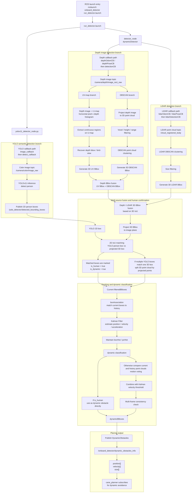

# LV-DOT Integration Notes

This note records the current LV-DOT integration state for the smart cane
navigation stack. It focuses on the planner-facing interface, sensor-topic
assumptions, and remaining perception-side caveats.

## Core Flow



## Planner Interface

LV-DOT publishes dynamic obstacles through:

```text
/onboard_detector/dynamic_obstacles_info
```

The message type is:

```text
onboard_detector/DynamicObstacles
```

The planner consumes the same interface, so the high-level connection between
LV-DOT and `cane_planner` is compatible. The message carries:

```text
position[]
velocity[]
size[]
```

## Current Defaults

The current detector configuration uses:

```text
lidar_pointcloud_topic: /cloud_registered_body
odom_topic: /Odometry
enable_lidar_detection: true
enable_depth_detection: true
enable_yolo_filtering: true
```

`run_detector.launch` also exposes lightweight runtime controls:

```text
enable_yolo
yolo_detection_rate
color_image_topic
publish_yolo_visualization
```

This allows YOLO to be disabled or retargeted without editing code.

## Point Cloud Frame Assumption

The LV-DOT LiDAR callback assumes the input point cloud is in a local
body/LiDAR-like frame, not already in the global map frame.

In `dynamicDetector::lidarOdomCB` and `dynamicDetector::lidarPoseCB`, the code:

1. Converts the input `PointCloud2` to PCL.
2. Filters points using the cloud's own local `x/y` values within
   `localLidarRange_`.
3. Applies the current LiDAR pose transform to move the cloud into the map
   frame.

Because of this, the preferred LiDAR input is:

```text
/cloud_registered_body
```

FAST-LIO publishes this topic with `frame_id = body`, which matches the current
LV-DOT assumption.

## Global Cloud Caveat

These topics are global-frame clouds:

```text
/cloud_registered
/corrected_current_pcd
```

They are not suitable as direct LV-DOT LiDAR inputs under the current callback
logic, because LV-DOT would filter them as if they were local clouds and then
apply another body-to-map transform.

Use a global cloud only after adding an explicit "cloud already in map frame"
mode that skips the local-frame filtering and transform path.

## Resolved Integration Issues

The following integration issues have been addressed in the current branch:

1. LiDAR input now defaults to `/cloud_registered_body`, matching the local cloud
   assumption.
2. `lidarOdomCB` and `lidarPoseCB` update the current LiDAR pose before
   transforming the incoming cloud, removing the previous one-frame pose lag.
3. Depth, LiDAR, YOLO filtering, debug visualization, and timer rates are exposed
   through ROS parameters.
4. YOLOv11 launch parameters now support configurable image topic, detection
   rate, visualization publishing, and launch-time disabling.

## Remaining Caveats

Full LiDAR-visual LV-DOT still requires valid RGB-D inputs:

```text
/camera/depth/image_rect_raw
/camera/color/image_raw
```

If these topics are not available, disable the unavailable branch in
`detector_param.yaml` or through launch arguments where supported.

For a full perception run, also verify:

1. Camera intrinsics match the actual RGB-D stream.
2. `body_to_camera_depth`, `body_to_camera_color`, and `body_to_lidar` extrinsics
   match the robot model.
3. YOLO runtime dependencies and `yolo11n.pt` are available.
4. `/Odometry` is consistent with the body-frame point cloud used by LV-DOT.
